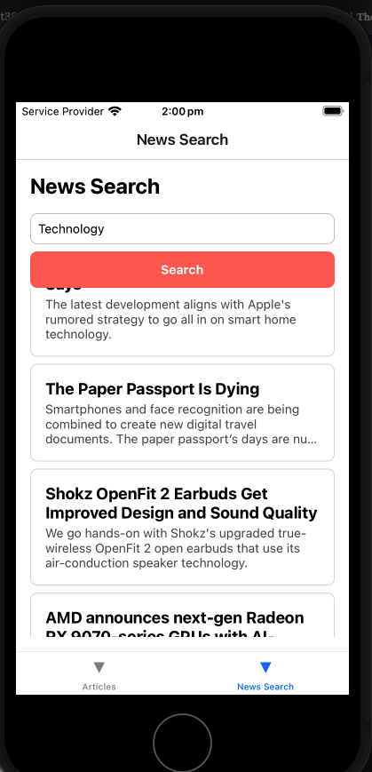

# News Search Application with React Native and Expo

This project is a mobile application built using React Native and Expo to meet the requirements for a news search application. The app interacts with the News API to fetch and display news articles based on user input.

## **Setup and Run Instructions**

### **Mobile App Setup**
1. Clone the repository:
   ```bash
   git clone <your-repository-url>
   cd <repository-folder>
   ```

2. Install dependencies:
   ```bash
   npm install
   ```

3. Start the Expo development server:
   ```bash
   expo start
   ```

4. Run the app on your desired platform:
    - Scan the QR code from your terminal or Expo Dev Tools to open the app on your phone using the Expo Go app.
    - For simulators/emulators, press `i` for iOS or `a` for Android in the terminal.

## **External Libraries Used**

1. **React Navigation**: For seamless navigation between screens.
    - Justification: React Navigation is a well-documented and widely-used library for handling navigation in React Native apps. It simplifies navigation logic while providing a great developer experience.

2. **Expo Router**: For file-based routing.
    - Justification: Expo Router integrates seamlessly with Expo projects, enabling declarative and predictable routing.

3. **Fetch API**: For API requests to the News API.
    - Justification: The Fetch API is built into JavaScript and provides a simple way to make HTTP requests without the need for additional dependencies.

## **Time Management**

- **Shortcuts Taken**:
    - Focused on achieving core functionality and UI instead of adding advanced features like persistent search history or animations.
    - Used basic styling for simplicity without exploring advanced design techniques (e.g., skeleton loaders for the articles list).

- **With More Time**:
    - Implemented persistent storage (e.g., AsyncStorage) to save search history locally.
    - Added unit and integration tests for the components and API interactions.
    - Improved the UI/UX with animations, skeleton loaders, and dark mode.

## **Assumptions**

1. Articles fetched from the API contain complete information, including `title`, `description`, and other relevant metadata.
2. The user provides a valid search query to fetch relevant articles.
3. The API response adheres to the structure tested during development.

## **Design Decisions**

1. **File Structure**: Used Expo Router for file-based routing, which aligns well with modular design practices.
2. **Error Handling**: Added error handling for invalid input, network failures, and cases with no results.
3. **Loading State**: Included an activity indicator to enhance user experience during API calls.

## **Implemented Features**

1. Real-time search functionality to fetch articles based on user input.
2. Graceful error handling for edge cases (e.g., empty search term, API errors, no results).
3. Clean and minimalistic UI for ease of use and readability.

## **Unimplemented Features**

1. Persistent storage for search history was not implemented due to time constraints.
2. Unit tests for components and API interactions were not included.
3. Responsive design improvements for tablets and larger screens.

## **How to Test**

1. Open the app and enter a search term in the input field.
2. Press the "Search" button to fetch news articles.
3. Verify that the articles are displayed in a list with titles and descriptions.
4. Test edge cases, such as:
    - Leaving the search field empty and pressing "Search."
    - Searching for terms with no results.

## **Screenshots**

### News Search Results


## **Expo Documentation**

This project extensively uses Expo for development. Refer to the [Expo Documentation](https://docs.expo.dev/) for details on configuration, routing, and deployment.

## **Future Improvements**

1. Add persistent storage using AsyncStorage to save search history locally.
2. Enhance the UI with animations and skeleton loaders.
3. Add pagination for large lists of articles.
4. Implement unit tests to ensure code reliability and robustness.
5. Provide support for dark mode to improve accessibility.
