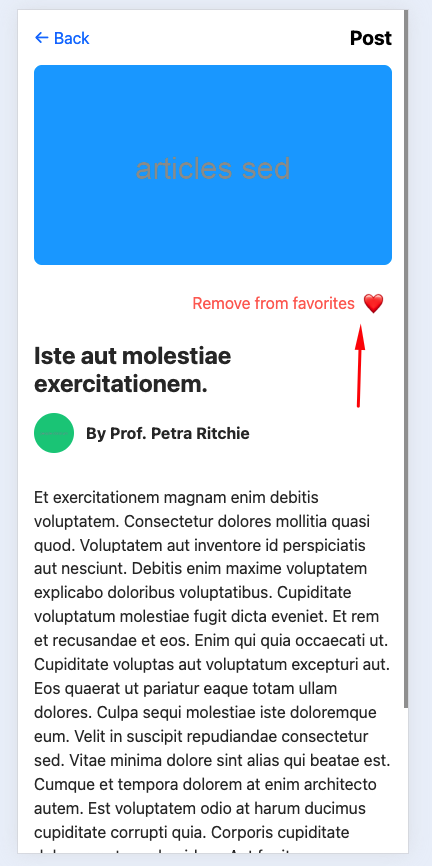

# Mobile Application with React Native and Expo

This project is a mobile application built using React Native and Expo to meet the requirements for a list and detail view of articles. The app interacts with a Laravel backend API to fetch articles and manage favorites.

## **Setup and Run Instructions**

### **Mobile App Setup**
1. Clone the repository:
   ```bash
   git clone <your-repository-url>
   cd <repository-folder>
   ```

2. Install dependencies:
   ```bash
   npm install
   ```

3. Start the Expo development server:
   ```bash
   expo start
   ```

4. Run the app on your desired platform:
   - Scan the QR code from your terminal or Expo Dev Tools to open the app on your phone using the Expo Go app.
   - For simulators/emulators, press `i` for iOS or `a` for Android in the terminal.

## **External Libraries Used**

1. **React Navigation**: For seamless navigation between screens (articles list and detail screens).
   - Justification: React Navigation is a well-documented and widely-used library for handling navigation in React Native apps. It simplifies navigation logic while providing a great developer experience.

2. **Expo Router**: For file-based routing.
   - Justification: Expo Router integrates seamlessly with Expo projects, enabling declarative and predictable routing.

3. **Axios**: For API requests to the Laravel backend.
   - Justification: Axios provides a promise-based HTTP client with a clean and concise syntax, simplifying API calls.

## **Time Management**

- **Shortcuts Taken**:
   - Focused on achieving core functionality and UI instead of adding advanced features like persistent storage for favorites or animations.
   - Used placeholder styling for simplicity without exploring advanced design techniques (e.g., skeleton loaders for the articles list).

- **With More Time**:
   - Implemented persistent storage (e.g., AsyncStorage or SQLite) to save favorite articles locally.
   - Added unit and integration tests for the components and API interactions.
   - Improved the UI/UX with animations, skeleton loaders, and dark mode.

## **Assumptions**

1. Articles fetched from the API contain complete information, including `title`, `text`, `image_url`, `author`, and `categories`.
2. Categories are predefined as `All Articles`, `Fitness`, and `Glucose Management`.
3. API response adheres to the structure tested during development.


## **Design Decisions**

1. **File Structure**: Used Expo Router for file-based routing, which aligns well with modular design practices.
2. **Custom Header**: Built a custom header for the detail screen to match the design requirements.
3. **Favorite Toggle**: Implemented a state-based favorite toggle for simplicity.

## **Unimplemented Features**

1. Persistent storage for favorite articles was not implemented due to time constraints.
2. Unit tests for components and API interactions were not included.
3. Responsive design improvements for tablets and larger screens.

## **How to Test**

1. Open the articles list screen and verify the list of articles fetched from the API.
2. Click on an article to navigate to the detail screen.
3. Test the "Add to favorites" functionality and ensure the state toggles correctly.

## **Screenshots**

### Articles List Screen


### Article Detail Screen


### Favorites Toggle


## **Expo Documentation**

Since this project was my first time using Expo, I referred to the [Expo Documentation](https://docs.expo.dev/) to understand the framework, routing, and configuration.
